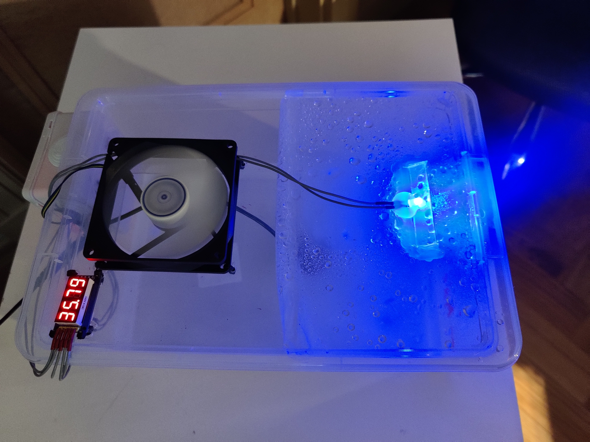
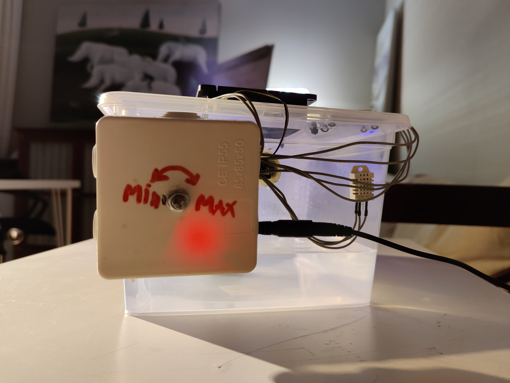

Automatic humidifier based on Arduino Nano, PlatformIO with Arduino framework and DHT22 humidity sensor. Original idea can be found in [autoHumidifier](https://github.com/AlexGyver/autoHumidifier) repository by AlexGyver.

